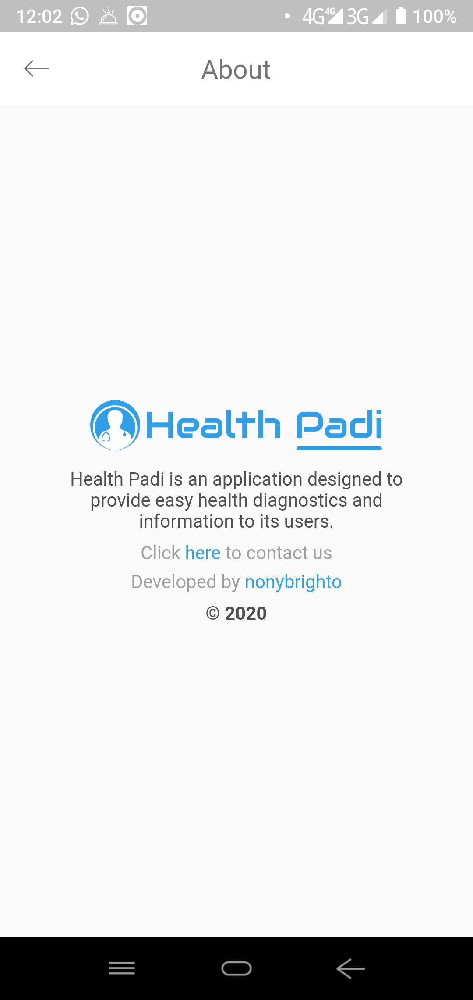

# healthpadi

Health Padi(Friend) is a kit for users that makes it easier for users to maintain a healthy life. Health Padi aims at aiding diagnostics and keeping users well informed on health related Issues around them.

## Features

- Health News around the world (IBM Discovery)
- Locate Health places around you - Google places/maps API
- Health Facts and Tips
- Diagnostic/Informative Chatbot - Dialogflow (In Progress)

## Screenshots

### Home & Info

  

### Places

  

### Facts/Tips & News

 
